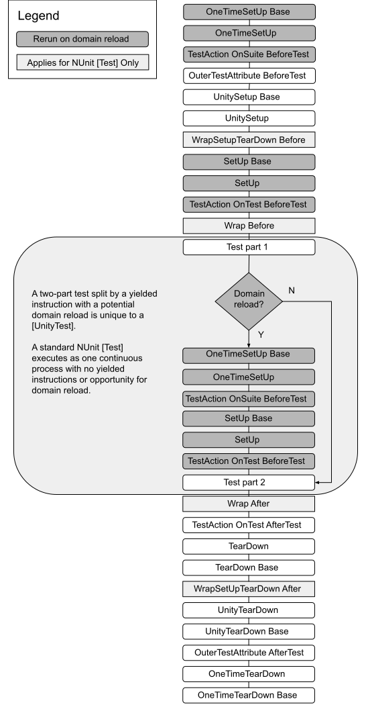
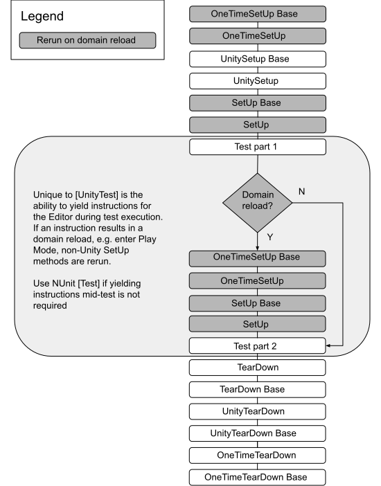

# Actions outside tests

In many cases you might find the standard NUnit [SetUp and TearDown](https://docs.nunit.org/articles/nunit/technical-notes/usage/SetUp-and-TearDown.html) attributes sufficient for performing pre-test setup and post-test teardown actions. Unity Test Framework extends these attributes with Unity-specific functionality. Our custom attributes [UnitySetUp and UnityTearDown](#unitysetup-and-unityteardown) can yield commands and skip frames, in the same way as [UnityTestAttribute](xref:UnityEngine.TestTools.UnityTestAttribute).

## Action execution order

The actions related to a test run in the following order:

* Attributes implementing [IApplyToContext](https://docs.nunit.org/articles/nunit/extending-nunit/IApplyToContext-Interface.html) 
* Any attribute implementing [IOuterUnityTestAction](xref:UnityEngine.TestTools.IOuterUnityTestAction) has its `BeforeTest` invoked
* Tests with [UnitySetUpAttribute](xref:UnityEngine.TestTools.UnitySetUpAttribute) methods in their test class
* Attributes implementing [IWrapSetUpTearDown](https://docs.nunit.org/articles/nunit/extending-nunit/ICommandWrapper-Interface.html) 
* Any method with the [SetUp](https://docs.nunit.org/articles/nunit/technical-notes/usage/SetUp-and-TearDown.html) attribute
* [Action attributes](https://docs.nunit.org/articles/nunit/extending-nunit/Action-Attributes.html?q=action) have their `BeforeTest` method invoked 
* Attributes implementing [IWrapTestMethod](https://docs.nunit.org/articles/nunit/extending-nunit/ICommandWrapper-Interface.html)  
* **The test itself runs**
* [Action attributes](https://docs.nunit.org/articles/nunit/extending-nunit/Action-Attributes.html?q=action) have their `AfterTest` method invoked
* Any method with the [TearDown](https://docs.nunit.org/articles/nunit/technical-notes/usage/SetUp-and-TearDown.html) attribute
* Tests with [UnityTearDownAttribute](xref:UnityEngine.TestTools.UnityTearDownAttribute) methods in their test class
* Attributes implementing [IOuterUnityTestAction](xref:UnityEngine.TestTools.IOuterUnityTestAction) has its `AfterTest` invoked

The list of actions is the same for both NUnit `Test` and `UnityTest`.

### Execution order

> **Note**: Some browsers do not support SVG image files. If the image above does not display properly (for example, if you cannot see any text), please try another browser, such as [Google Chrome](https://www.google.com/chrome/) or [Mozilla Firefox](https://www.mozilla.org). 

## Unity OuterTestAttribute

An OuterTestAttribute is a Unity wrapper outside of tests, which allows for any tests with this attribute to run code before and after the tests. This method allows for yielding commands in the same way as `UnityTest`. The attribute must inherit the `NUnitAttribute` and implement [IOuterUnityTestAction](xref:UnityEngine.TestTools.IOuterUnityTestAction). 

### Execution order 

Unity OuterTestAttribute methods are not rerun on domain reload but [NUnit Action attributes](https://docs.nunit.org/articles/nunit/extending-nunit/Action-Attributes.html?q=action) are:

> **Note**: Some browsers do not support SVG image files. If the image above does not display properly (for example, if you cannot see any text), please try another browser, such as [Google Chrome](https://www.google.com/chrome/) or [Mozilla Firefox](https://www.mozilla.org). 

## UnitySetUp and UnityTearDown

The `UnitySetUp` and `UnityTearDown` attributes are identical to the standard NUnit `SetUp` and `TearDown` attributes, with the exception that they allow for [yielding instructions](reference-custom-yield-instructions.md). The `UnitySetUp` and `UnityTearDown` attributes expect a return type of [IEnumerator](https://docs.microsoft.com/en-us/dotnet/api/system.collections.ienumerator?view=netframework-4.8). 

### Execution order

`UnitySetUp` and `UnityTearDown` can be used with either the `Test` or `UnityTest` test attributes. In both cases the relative execution order of Unity and non-Unity `SetUp` and `TearDown` attributes is the same. The only difference is that a `UnityTest` allows for yielding instructions during the test that can result in a domain reload, in which case the non-Unity `SetUp` and `TearDown` methods are re-run before proceeding to the second part of the test.

> **Note**: Some browsers do not support SVG image files. If the image above does not display properly (for example, if you cannot see any text), please try another browser, such as [Google Chrome](https://www.google.com/chrome/) or [Mozilla Firefox](https://www.mozilla.org). 

### Base and Derived classes

The term **base** in the execution order denotes a base class from which a test class inherits. `UnitySetUp` and `UnityTearDown` follow the same pattern as NUnit `SetUp` and `TearDown` attributes in determining execution order between base classes and their derivatives. `SetUp` methods are called on base classes first, and then on derived classes. `TearDown` methods are called on derived classes first, and then on the base class. See the [NUnit Documentation](https://docs.nunit.org/articles/nunit/technical-notes/usage/SetUp-and-TearDown.html) for more details.

## Domain Reloads

In **Edit Mode** tests it is possible to yield instructions that can result in a domain reload, such as entering or exiting **Play Mode** (see [Custom yield instructions](./reference-custom-yield-instructions.md)). When a domain reload happens, all non-Unity actions (such as `OneTimeSetup` and `Setup`) are rerun before the code that initiated the domain reload continues. Unity actions (such as `UnitySetup`) are not rerun. If the Unity action is the code that initiated the domain reload, then the rest of the code in the `UnitySetup` method runs after the domain reload.
